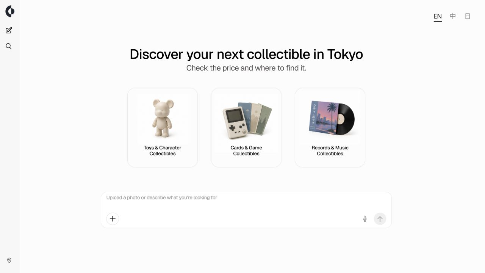
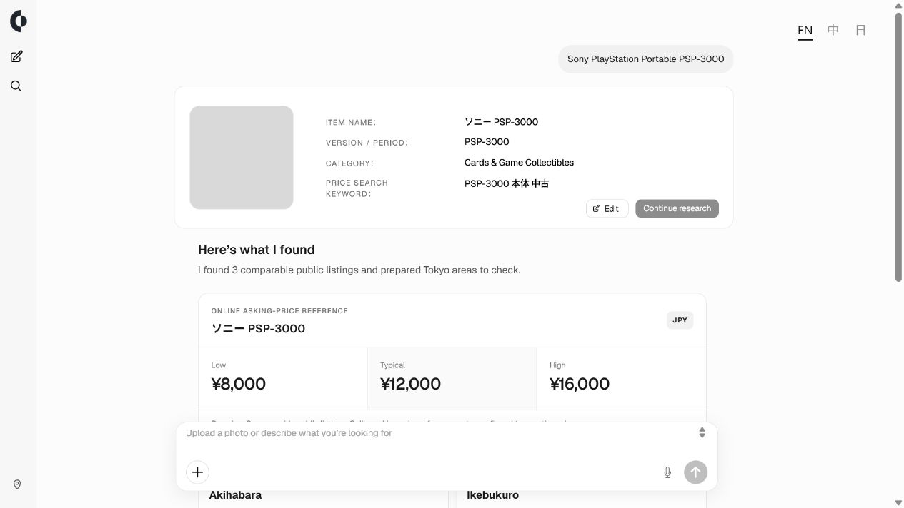

# Curio — Tokyo Collectible Research Agent

<p align="center">
  
</p>

Curio
AI research agent for identifying Japanese collectibles, comparing marketplace prices, and discovering where to find them in Tokyo.

Curio is a full-stack web application that identifies a collectible from an image or text, checks public Japanese marketplace listings, calculates an explainable asking-price reference, and suggests Tokyo shopping areas.

demolink : https://foragent-testing.vercel.app/
Acesscode：agent-forge-demo

[Architecture](./docs/ARCHITECTURE.md) · [Developer guide](./docs/DEVELOPMENT.md)

[](https://github.com/vincentlow02/Tokyo-Collectible-Research-Agent/actions/workflows/ci.yml)

> Curio reports public asking prices. It does not claim confirmed sale prices, authenticity, appraised value, or live store inventory.

## Demo preview

| Start an analysis | Review an explainable result |
| --- | --- |
|  |  |

The result screenshot uses deterministic fixture data so the interface can be reproduced without consuming provider credits.

## My contribution

Curio was designed and implemented independently by the repository owner from the initial product idea through the deployed demo. The work includes:

- defining the product scope and end-to-end architecture;
- integrating Qwen image and text identification with structured output validation;
- designing and implementing the deterministic listing filters and price-reference algorithm;
- building the responsive, localized user interface and analysis workflow;
- implementing provider orchestration, stateless streamed research, upload validation, and error redaction;
- supporting Vercel with remote Browserless Chromium plus optional Docker deployment;
- adding automated tests, strict type checks, GitHub Actions, production smoke tests, GA4, and Microsoft Clarity.

AI services are used at runtime for item identification and controlled fallback research. The application logic, pricing rules, interface, deployment configuration, and test suite are implemented in this repository.

## Recognition

Curio was selected as a **Top 10 finalist** at the **Agent Forge AI Hackathon**. It was built and presented as a solo project.

## What the project does

1. Accepts a photo or a specific text description.
2. Uses Qwen to produce a structured identity: item name, version, category, and Japanese search keyword.
3. Lets the user review the identity before marketplace research begins.
4. Reads public Rakuten and Mercari result pages with Playwright.
5. Filters mismatched, duplicate, broken, incomplete, sold-out, and extreme-price listings.
6. Calculates a low, median, and high asking-price reference in deterministic Node.js code.
7. Shows source links, warnings, Tokyo area suggestions, and per-provider run details.

Supported categories are toys and character goods, cards and game collectibles, and records and music memorabilia. Collector Mode also records visible edition and condition evidence and checks limited active-auction signals separately from the price range.

## Architecture in simple language

The AI identifies the item, but it does not decide the price. Pricing is calculated by regular TypeScript code from listings that pass explicit matching rules. This separation makes the result easier to inspect and test.

```text
User
  ↓
Next.js frontend
  ↓
Next.js API routes
  ↓
Qwen identification + streamed research request
  ↓
Shared browser provider
  ↓
Local Chromium or Browserless remote Chromium
  ↓
Deterministic Node.js price calculation
  ↓
Optional Tavily fallback + Daytona verification
  ↓
Result returned to the frontend
```

There is no database or server-side session store. Each identification and research request is self-contained. Recent history and image previews stay in the user's browser through `localStorage` and IndexedDB.

See [docs/ARCHITECTURE.md](./docs/ARCHITECTURE.md) for component responsibilities, trust boundaries, and design tradeoffs.

## Engineering decisions

| Decision | Reason |
| --- | --- |
| Constrain Qwen to structured identification | Keeps model output away from pricing and inventory claims. |
| Calculate prices in TypeScript | Makes filtering and aggregation repeatable and unit-testable. |
| Keep source URLs with every sample | Lets users inspect the evidence behind the range. |
| Use median absolute deviation for outliers | Prevents a small number of extreme listings from dominating the range. |
| Use one shared Browserless connection per research | Keeps free browser usage bounded while allowing independent marketplace pages. |
| Run optional Daytona verification | Recalculates normalized price data independently without sharing provider keys. |
| Treat Tavily as a limited fallback | It runs only when primary marketplaces provide no valid samples. |

## Technology

| Area | Tools used |
| --- | --- |
| Frontend | Next.js 16, React 19, TypeScript, Geist |
| Backend | Next.js Route Handlers, Node.js |
| AI identification | Qwen through an OpenAI-compatible API |
| Data collection | playwright-core, Browserless, Rakuten, Mercari, optional Yahoo! Auctions and Mandarake Auction |
| Fallback and verification | Tavily, Daytona |
| Testing | Vitest, TypeScript strict checks, container smoke test |
| Deployment and analytics | Vercel, Browserless, optional Docker, GitHub Actions, GA4, Microsoft Clarity |

## Project structure

Only the main folders are shown here:

```text
.
├── .github/workflows/       CI checks for tests, types, build, audit, and container smoke test
├── docs/                    Architecture and project documentation
├── src/app/                 Pages and API routes
├── src/features/            Analysis UI, stream handling, localization, and browser-side history
├── src/core/                Identification contracts and recommendation rules
├── src/price/               Marketplace capture, matching, filtering, and price calculation
├── src/server/              Stateless pipeline, browser/provider adapters, and security
├── src/daytona/             Independent price-calculation verification
├── scripts/                 Local analysis, replay, and provider smoke-test commands
├── tests/                   Unit and integration tests
└── public/                  Brand and interface assets
```

## Getting started

### Prerequisites

- Node.js 20 or newer
- npm
- Chromium installed through Playwright
- Optional provider accounts for live mode: Qwen, Daytona, and Tavily
- A Browserless account for live Vercel marketplace research

### Installation

```bash
git clone https://github.com/vincentlow02/Tokyo-Collectible-Research-Agent.git
cd Tokyo-Collectible-Research-Agent
npm install
npx playwright install chromium
```

Copy `.env.example` to `.env.local`:

```bash
cp .env.example .env.local
```

On Windows PowerShell, use `Copy-Item .env.example .env.local`.

### Environment variables

Never commit `.env.local`. Use placeholders such as these:

```dotenv
QWEN_API_KEY=your-qwen-api-key
QWEN_BASE_URL=https://your-workspace-id.example.com/compatible-mode/v1
QWEN_VISION_MODEL=your-vision-model
QWEN_TEXT_MODEL=your-text-model

DEMO_ACCESS_CODE=replace-with-a-long-demo-code
DEMO_RATE_LIMIT_WINDOW_MINUTES=60
DEMO_RATE_LIMIT_MAX_REQUESTS=5
DEMO_GLOBAL_DAILY_LIMIT=50
WEB_USE_FIXTURE=true

DAYTONA_API_KEY=your-daytona-api-key
ENABLE_DAYTONA_PROCESSING=false

TAVILY_API_KEY=your-tavily-api-key
ENABLE_TAVILY_PRICE_FALLBACK=false

BROWSER_PROVIDER=browserless
BROWSERLESS_WS_ENDPOINT=wss://production-sfo.browserless.io
BROWSERLESS_API_TOKEN=your-browserless-token
BROWSER_SESSION_TIMEOUT_SECONDS=55
RESEARCH_TIME_BUDGET_SECONDS=240

NEXT_PUBLIC_GA_MEASUREMENT_ID=
NEXT_PUBLIC_CLARITY_PROJECT_ID=
```

Use `WEB_USE_FIXTURE=true` to explore the interface and deterministic pipeline without consuming provider credits. The complete variable list and safe placeholders are in [`.env.example`](./.env.example).

### Local development

```bash
npm run dev
```

Open [http://localhost:3000](http://localhost:3000).

### Build and verify

```bash
npm run typecheck
npm test
npm run build
```

The current repository contains 42 passing tests across 11 test files. GitHub Actions also runs a production container smoke test.

## Demo

- Live application: add the verified Vercel URL after the first production deployment
- GitHub: [vincentlow02/Tokyo-Collectible-Research-Agent](https://github.com/vincentlow02/Tokyo-Collectible-Research-Agent)
- Access code: shared privately with reviewers

The access code is intentionally not committed. Process-local request limits are best-effort on Vercel, while provider dashboards supply the hard usage controls. Browserless Free currently provides 1,000 units per month; a normal Curio research uses one connection for all primary pages and is expected to consume one or two units. This is a planning estimate, not a measured capacity claim.

## License

The source code is available under the [MIT License](./LICENSE), allowing reuse, modification, and distribution with attribution. Third-party services, marketplace content, trademarks, and visual assets remain subject to their own terms.
